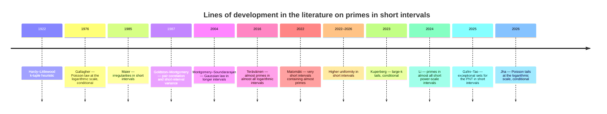
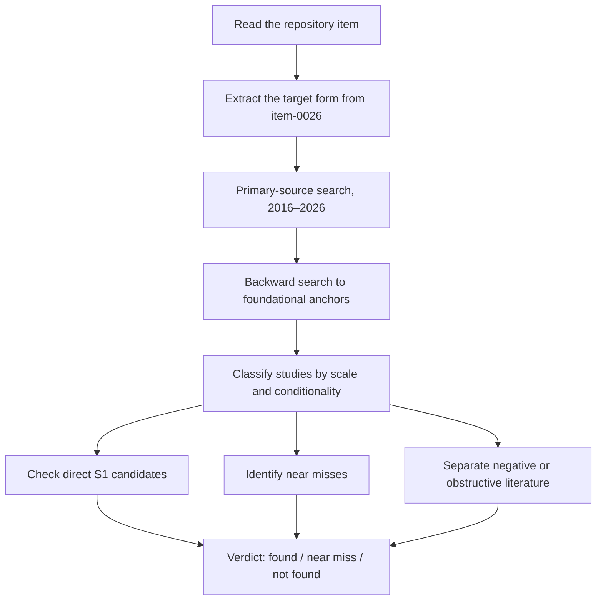

# Literature Review for item-0026 at Commit 356bae5

> **Translation note.** This document is an English translation of the previously generated German report. Mathematical notation, project identifiers, evidence classifications, tables, diagrams, and the report's conclusions have been preserved. No new literature search or source verification was conducted for this translation.

## Executive summary

The **istr/erdos251** repository describes item-0026 as a web-assisted literature review asking whether there is an **unconditional, averaged middle-slot non-concentration or upper-uniformity theorem** strong enough for the **relaxed (CG) requirement**—that is, a statement of **constant strength**, **without uniformity in \(s\)**, and only along a **thin, unbounded sequence of scales for each \(s\)**, rather than the stronger form that holds for “all sufficiently large \(x\)” uniformly in \(s\).

The item explicitly requires a verdict of the form **found / near miss / not found**, assessed against primary sources. The literature finding as of **July 24, 2026** is:

> **No unconditional primary theorem was found that directly matches the target form of item-0026.**

The strongest **near misses** at the logarithmic scale are all **conditional**. Gallagher derives a Poisson distribution in intervals of length \(\lambda\log x\) from Hardy–Littlewood assumptions; Kuperberg extends this line to larger \(k\) and obtains conditional tail bounds; and Jha studies the Poisson-tail question for growing \(\lambda\), again conditionally.

The strongest **unconditional neighboring literature**, by contrast, works in **substantially longer intervals** or with **weaker objects**. Higher uniformity for \(\Lambda\) is available only for interval lengths such as

\[
H \ge X^{5/8+\varepsilon}
\]

for all intervals, or

\[
H \ge X^{1/3+\varepsilon}
\]

for almost all intervals. Recent PNT or prime-existence results in short intervals operate at power scales such as

\[
x^{17/30+o(1)},\qquad x^{39/40},\qquad x^{0.52},
\]

or, for almost all \(x\), at length

\[
x^{1/21.5+\varepsilon}.
\]

At a genuinely logarithmic scale, notable unconditional results concern **almost primes**, not primes.

The strict working verdict for item-0026 is therefore:

> **literature-grain not found** for an exact unconditional S1 carrier.

The most plausible adjoining lines are:

- conditional logarithmic-scale distribution laws;
- unconditional logarithmic-scale results for almost primes;
- unconditional prime-uniformity results only at power scales.

This is a **literature judgment**, not an impossibility theorem.

## Project context and refined research questions

The **erdos251** project studies Erdős Problem 251—the irrationality of

\[
\sum_{n\ge 1}\frac{p_n}{2^n}
\]

—through structures in the sequence of prime gaps. Item-0026 isolates the literature-facing question of whether an external theorem already supplies the missing S1-type control of the middle slot in the repository's current exchange architecture.

Four operational research questions follow from item-0026.

First, does the external mathematical literature contain an **unconditional** theorem that directly corresponds to the required S1 carrier?

Second, if not, which **conditional** results come closest to the target form, especially at the **logarithmic scale**

\[
h\asymp \lambda\log x?
\]

Third, which **unconditional near misses** exist at a **weaker scale** or for **related objects**, such as almost primes, higher uniformity, or exceptional sets?

Fourth, which literature argues **against** naive strong uniformity assumptions without already ruling out the relaxed (CG) form?

The repository-internal relaxation is decisive for the assessment. The target is no longer an \(s\)-uniform vanishing statement valid for all sufficiently large \(x\). It requires only **constant-order strength**, **no uniformity in \(s\)**, and a **thin infinite sequence of scales for each \(s\)**. Results about **almost all intervals**, **exceptional sets**, and **thin sequences** are therefore relevant even when they do not meet the original stronger form.

The following timeline records the lines of research most relevant to item-0026. Older literature is unavoidable because the item rests on classical logarithmic-scale and short-interval questions. The systematic search itself focused on the last ten years and was then extended backward through indispensable primary anchors.

## Literature-search method

The review was conducted as a **targeted primary-source search**, starting from the exact task specification in [`roadmap/item-0026.md`](https://github.com/istr/erdos251/blob/356bae5be37d84788ed5c02b2d664637e7f6c871/roadmap/item-0026.md) at commit `356bae5…`.

The search focused primarily on work concerning:

- primes in short intervals;
- distributions, tails, and moments;
- higher uniformity;
- exceptional sets;
- almost-all intervals;
- singular series;
- pair correlation;
- almost primes at logarithmic scales.

This scope was chosen because item-0026 explicitly asks for a decision about the “absent middle-slot carrier” and about `NI-M2`/`NI-M4`.

Only **primary sources or official journal/arXiv pages** were used for the mathematical findings. The repository served only to specify the research question, not as external mathematical evidence. Item-0026 itself requires this separation.

The default time horizon was **2016–2026**. From there, a **backward search** was extended to indispensable foundational works whenever newer primary papers identified them as defining the question. Gallagher (1976), Maier (1985), Goldston–Montgomery (1987), and Montgomery–Soundararajan (2004) therefore had to be included: newer work builds on this chain, and item-0026 concerns precisely the transition among logarithmic-scale Poisson behavior, Maier-type irregularity, moment methods, and modern short-interval uniformity results.

Studies were included when they met at least one of the following criteria:

- direct treatment of **prime distributions in short intervals**;
- treatment of **moments, tails, or variances** of the relevant counting functions;
- results on **higher uniformity** of \(\Lambda\) in short intervals;
- results on the **PNT in short intervals**, including **exceptional sets**;
- logarithmic-scale **almost-prime results** that are methodologically plausible near misses.

Informal forum material and AI-generated content were excluded as mathematical evidence.

The core assessment used three classes:

1. **found**;
2. **near miss with an identified gap**;
3. **not found**.

This three-way classification is taken directly from item-0026.

The evidence synthesis proceeded in two stages. First came a **theorem-oriented screening** for relevance to the S1 target. Second came a **regime classification** by:

- scale: \(\log x\), \((\log x)^A\), or \(x^\theta\);
- validity type: all \(x\), almost all \(x\), or thin sequences;
- conditionality: unconditional, RH/LI, or Hardy–Littlewood.

This regime classification is essential because item-0026 explicitly distinguishes the stronger shelf form from the relaxed (CG) form.

## Evidence synthesis

### Direct candidates at the logarithmic scale

The mathematically **closest candidates** to item-0026 occur at the **logarithmic scale**

\[
h\asymp \lambda\log x,
\]

but they are **not unconditional matches**.

Gallagher showed in 1976 that a strong Hardy–Littlewood hypothesis implies that the number of primes in intervals of length \(\lambda\log N\), on average, tends to a Poisson distribution. This is the classical conditional reference for “local” random models of the primes.

Kuperberg moves this line in the direction most relevant to item-0026. She studies sums of singular series over **larger sets** and derives conditional statements about the **tail** of the prime-count distribution in intervals

\[
[n,n+\lambda\log x].
\]

Under suitable Hardy–Littlewood assumptions, she obtains bounds of the form

\[
I(x;k,h)\ll x\exp\!\left(-\frac{k}{\lambda e}\right),
\]

with the relevant rank range

\[
k\ll(\log h)^{1-\delta}.
\]

This is substantially closer than Gallagher's result to an “averaged upper-uniformity” statement, but it remains **conditional**.

Jha develops the same Poisson-tail question further in 2026. Again under a strong Hardy–Littlewood-type assumption, the work studies the validity and limitations of the folklore Poisson Tail Conjecture when \(\lambda\) is allowed to grow rather than remain fixed.

For item-0026, this matters because it shows that the mathematical literature is pursuing both the **right scale** and the **right statistical form**. The missing breakthrough, however, remains tied to **conditional singular-series input**.

Leung's work on the **joint distribution** of primes in several short intervals is also relevant. Under RH and LI, it obtains a multivariate Gaussian logarithmic limiting distribution with weak negative correlations. This is a modern and highly structured distribution theorem for moving short intervals, but it is both **weighted** and **conditional**, so it is not a direct unconditional S1 carrier.

The robust intermediate conclusion is therefore:

> **Yes, the target form exists in the literature as a mathematically natural logarithmic-scale question; no, no unconditional primary theorem was found that directly meets the item-0026 requirement.**

The best class of direct near misses remains **conditional**.

### Unconditional results in longer intervals

The modern **unconditional** literature is now strong, but it operates almost entirely at **power scales**

\[
H=X^\theta,
\]

not at \(\lambda\log x\).

A key result of Guth and Maynard provides new zero-density estimates and consequent asymptotics for primes in intervals of length

\[
x^{17/30+o(1)}.
\]

Gafni and Tao further exploit these advances and formulate explicit exceptional-set bounds. In this framework, the PNT in short intervals is known for **all** \(x\) when

\[
\theta>\frac{17}{30},
\]

and for **almost all** \(x\) when

\[
\theta>\frac{2}{15}.
\]

This is methodologically highly relevant, but it remains far from the logarithmic scale sought by item-0026.

A second line consists of **existence theorems** for at least one prime in a short interval. Matomäki, Merikoski, and Teräväinen give a 2024 proof, avoiding \(L\)-functions, that

\[
(x-x^{39/40},x]
\]

contains primes for sufficiently large \(x\).

Runbo Li improves the classical Baker–Harman–Pintz line and shows that

\[
[x-x^{0.52},x]
\]

contains primes for all sufficiently large \(x\). Li also sharpens a 1996 result of Jia by proving that, for **almost all** \(n\),

\[
[n,n+n^{1/21.5+\varepsilon}]
\]

contains a prime.

These are unconditional milestones for short intervals, but they provide **no fine logarithmic-scale distribution statement** of the kind sought in item-0026.

A third line concerns **higher uniformity**. Matomäki, Shao, Tao, and Teräväinen proved in 2022 structural uniformity properties of \(\Lambda\) in **all** intervals satisfying

\[
X^{5/8+\varepsilon}\le H\le X^{1-\varepsilon}.
\]

In 2024/2026, Matomäki, Radziwiłł, Shao, Tao, and Teräväinen extended this to **almost all** intervals, reaching for \(\Lambda\) the threshold

\[
H\ge X^{1/3+\varepsilon}.
\]

These works come closest to an “upper-uniformity” vocabulary, but again only at scales enormously longer than \(\log x\).

For item-0026, the implication is that the most modern unconditional literature makes **distributional control**, **Gowers uniformity**, and **exceptional-set control** accessible for primes in short intervals—but only in regimes far beyond the logarithmic-scale problem implicit in the item. These results are therefore important unconditional near misses: they **locate the gap** rather than close it.

### Logarithmic-scale near misses via almost primes

One especially revealing finding is that deep **unconditional** results do exist at genuinely **logarithmic scales**, but for **almost primes**, not primes.

Teräväinen showed in 2016 that almost all intervals

\[
[x,x+\log^{1+\varepsilon}x]
\]

contain integers with exactly three prime factors, and that almost all intervals

\[
[x,x+\log^{3.51}x]
\]

contain integers with exactly two prime factors.

Matomäki subsequently showed that almost all intervals

\[
(x-h\log X,x],\qquad h\to\infty,
\]

contain a product of at most two primes.

Matomäki and Teräväinen further improved the two-prime-factor case to almost all intervals of length

\[
(\log x)^{2.1}.
\]

This is remarkably close to the scale relevant to item-0026. These papers are especially valuable for the assessment because they show that **typical**, very short logarithmic intervals can be controlled finely by current methods once the object is weakened slightly—from primes to numbers with two or three prime factors.

The difference between “prime” and “almost prime” is therefore not a minor technicality; it appears to be the central methodological threshold. It is plausible that an unconditional logarithmic-scale S1 carrier for primes, if one exists, will require ideas beyond the existing Type-I/II and sieve literature.

That is a **literature inference**, not a theorem.

### Negative and structuring evidence

Maier is indispensable for item-0026. Montgomery and Soundararajan explicitly recall that Cramér's prediction for intervals of length

\[
(\log x)^a
\]

is **false**. Maier showed that the normalized prime count in such intervals does not tend to \(1\); its limsup and liminf lie on opposite sides of \(1\).

For item-0026, this means that any overly strong “quasi-Poisson” or equidistribution intuition at the logarithmic scale, valid for all sufficiently large \(x\), is already under classical pressure.

At the same time, the classical theory explains why **variance and moment questions** are central. Goldston and Montgomery connected short-interval variance to pair-correlation statements for the zeros of the zeta function. Chan summarized in 2002 that, under RH, Goldston and Montgomery had established an equivalence between strong pair correlation and certain second moments of primes in short intervals. Chan's 2004 work on higher moments also remains conditional on RH.

These results help explain why direct unconditional local-distribution theorems are so difficult.

Montgomery and Soundararajan also identify a second transition: in longer intervals, the Poisson picture is replaced by a **Gaussian law**, at least heuristically and under strong assumptions. Granville and Lumley showed heuristically and numerically in 2020 that the behavior of maxima and minima of prime counts is especially subtle in the range between

\[
\log x
\quad\text{and}\quad
(\log x)^2.
\]

This matters because S1 operates precisely in this delicate transition range.

Translated into the repository's relaxed (CG) form:

> **Maier does not rule out the possibility of (CG) itself, but it does rule against naive stronger variants.**

Because item-0026 requires only a **thin infinite sequence for each \(s\)** and **constant-order strength**, the mathematical search space remains open. The literature suggests, however, that a successful result is more likely to be **averaged**, **tolerant of exceptional sets**, or **sequential** than globally uniform.

No such unconditional primary theorem was found.

## Comparison of key studies

The following table classifies the **most direct candidates** for item-0026.

| Study | Year | Method | Regime / “sample” | Main result | Relation to item-0026 | Main limitation |
|---|---:|---|---|---|---|---|
| Gallagher | 1976 | Singular series; Hardy–Littlewood | Intervals \(h\sim\lambda\log N\) | Conditional Poisson distribution for prime counts in logarithmic intervals | **Near miss at exactly the right scale** | Conditional on strong Hardy–Littlewood assumptions |
| Goldston–Montgomery | 1987 | Pair correlation / variance | Second moments in short intervals | Connects zeta-zero pair correlation with short-interval variance | **Structurally relevant** | Not an unconditional carrier; primarily meta-structural |
| Montgomery–Soundararajan | 2004 | Moments; Hardy–Littlewood heuristic/conditionality | \(N^\delta\le H\le N^{1-\delta}\) | Gaussian distribution with variance \(H\log(N/H)\), rather than Cramér–Poisson | **Important near miss** | Intervals are much longer than \(\log x\); not an unconditional S1 carrier |
| Kuperberg | 2023 | Singular-series sums over large sets; moment method | \(h=\lambda\log x\), \(k\ll(\log h)^{1-\delta}\) | Conditional tail bound \(I(x;k,h)\ll x e^{-k/(\lambda e)}\) | **Strongest direct near miss** | Conditional; rank range remains restricted |
| Leung | 2024 | Weighted short-interval counts; RH+LI | Several moving short intervals | Multivariate Gaussian distribution with weak negative correlation | **Modern distributional proximity** | RH+LI; weighted and not item-exact |
| Jha | 2026 | Conditional Poisson-tail analysis | Growing \(\lambda\), logarithmic scale | Identifies phase transitions and limits of the Poisson-tail heuristic | **Highly relevant to the S1 statement form** | Fully conditional |

The **unconditional neighboring literature** is broad, but almost always lies in the wrong regime.

| Study | Year | Method | Regime / “sample” | Main result | Relevance to item-0026 | Main limitation |
|---|---:|---|---|---|---|---|
| Maier | 1985 | Matrix method / irregularity | Intervals of length \((\log x)^a\) | Cramér-type mean prediction fails; strong oscillation occurs | Negative structural anchor | Shows irregularity but supplies no positive carrier |
| Teräväinen | 2016 | Sieve methods; almost primes | Almost all intervals \([x,x+\log^{1+\varepsilon}x]\) and \([x,x+\log^{3.51}x]\) | \(E_3\)- and \(E_2\)-numbers in almost all very short intervals | **Important logarithmic-scale near miss** | Almost primes rather than primes |
| Matomäki | 2022 | Weighted sieve; Kloosterman sums | Almost all \((x-h\log X,x]\), \(h\to\infty\) | A product of at most two primes in almost all very short intervals | **Very close to the logarithmic scale** | Again only almost primes |
| Matomäki–Teräväinen | 2023 | Type-II estimate | Almost all \((x,x+(\log x)^{2.1}]\) | A product of exactly two primes in almost all intervals | **Very strong almost-prime near miss** | No statement for primes |
| Matomäki–Shao–Tao–Teräväinen | 2022 | Higher uniformity; nilsequences | All intervals, \(H\ge X^{5/8+\varepsilon}\) | Uniformity of \(\Lambda\) and applications to linear equations in primes | **Close in uniformity mechanism** | Power scale, not logarithmic scale |
| Matomäki–Radziwiłł–Shao–Tao–Teräväinen | 2024/26 | Higher uniformity in almost all intervals | Almost all intervals, \(\Lambda\) for \(H\ge X^{1/3+\varepsilon}\) | Small short-interval Gowers norms; Hardy–Littlewood/divisor correlations with a short average | **Strong mechanistic near miss** | Almost-all result and power scale |
| Li | 2023/25 | Harman sieve; numerical optimization | \([x-x^\theta,x]\), \(0.52\le\theta\le0.525\) | \([x-x^{0.52},x]\) contains primes for large \(x\) | Unconditional short-interval progress | Far from \(\log x\) |
| Li | 2024 | Mean-value methods; “almost all” | \([n,n+n^{1/21.5+\varepsilon}]\) for almost all \(n\) | Almost all such intervals contain primes | Demonstrates the power of almost-all regimes | Still a power scale, not a logarithmic scale |
| Gafni–Tao | 2025/26 | Exceptional sets from zero-density estimates | PNT in short intervals | All \(x\) for \(\theta>17/30\); almost all \(x\) for \(\theta>2/15\) | Best recent exceptional-set context | Again a power scale |

Together, the tables expose the central finding:

> **The theoretically best-matched papers are conditional; the unconditional papers are in the wrong regime or concern almost primes.**

This is exactly the classification required by item-0026: **a near miss with an identified gap**, rather than a positive find.

## Research gaps and prioritized next steps

The literature points to eight prioritized follow-up questions.

### 1. Search systematically for unconditional upper tails at the logarithmic scale

The most direct next step is a focused search for **unconditional** bounds on

\[
\#\left\{n\le x:
\pi(n+\lambda\log x)-\pi(n)\ge k
\right\}
\]

for slowly growing \(k\), especially work following Kuperberg or Jha that removes at least part of the conditional input.

### 2. Isolate the almost-prime-to-prime gap

The almost-prime literature shows that surprisingly strong control is already possible at logarithmic scales. The open methodological question is which component of those methods fails at the final threshold between "\(P_2/P_3\)" and "prime."

This is probably the narrowest genuine attack point on item-0026.

### 3. Translate exceptional-set results into (CG)-compatible subsequence statements

The Gafni–Tao and Guth–Maynard lines operate at power scales, but they demonstrate how one can weaken “all \(x\)” to “almost all \(x\)” or to controlled exceptional sets.

The item-0026 relaxation to thin sequences for each \(s\) suggests examining whether that transfer mechanism has a theoretical analogue compatible with (CG).

### 4. Bibliograph positive-proportion and lower-moment surrogates separately

The repository itself notes that a weaker averaged carrier may be enough. The research program should therefore search not only for exact analogues of `NI-M2` or `NI-M4`, but separately for:

- **positive mass** statements;
- **lower moment** estimates;
- **one-sided upper bounds**;
- **selection averages**.

### 5. Test modern short-interval uniformity work for “de-scaling”

The higher-uniformity results work at scales too long for direct application, but they contain sophisticated structural machinery for \(\Lambda\).

A targeted technical question is which parts of the Type-II and nilsequence machinery could in principle be pushed into thinner regimes, and which parts fundamentally cannot.

### 6. Connect modern pair-correlation and moment results more tightly to item-0026

The classical Goldston–Montgomery and Chan connection shows that moment information remains the natural access point.

A separate literature task should map the **second and higher moments** of primes in short intervals specifically with respect to upper tails and non-concentration.

### 7. Use Maier as a regime filter, not as a killer

Maier argues against global uniformity at logarithmic scales, but not against thin sequences or averaged statements.

Methodologically, Maier should be used as a filter:

- candidates claiming validity for all sufficiently large \(x\) are immediately suspect;
- candidates involving exceptional sets, thin sequences, or averaging remain relevant.

### 8. Build a theorem-precise mapping table

An internal matrix should record, for each candidate theorem:

- interval length;
- type of averaging;
- conditionality;
- target quantity;
- \(k\)-regime;
- quantified statement form;
- compatibility with (CG).

Without this normalization, conditional logarithmic-scale results and unconditional power-scale results will repeatedly be conflated.

## Recommended primary sources and authoritative references

The following sources form the recommended core canon for further work on item-0026. Bibliographic titles are retained as in the source report; this translation does not add or re-resolve hyperlinks.

### Project and task specification

- [`roadmap/item-0026.md`](https://github.com/istr/erdos251/blob/356bae5be37d84788ed5c02b2d664637e7f6c871/roadmap/item-0026.md) at commit `356bae5…`: exact target form, acceptance criteria, and contamination rules; indispensable for interpreting the task.
- [`dossier/item-0010-workpapers/separator-repricing.md`](https://github.com/istr/erdos251/blob/356bae5be37d84788ed5c02b2d664637e7f6c871/dossier/item-0010-workpapers/separator-repricing.md): explains why `NI-M2`/`NI-M4` currently appear in the repository as missing S1 carriers. Important project context, but not external mathematical evidence.

### Classical primary anchors

- Gallagher, *On the distribution of primes in short intervals* (1976): the classical starting point for conditional Poisson statistics at the logarithmic scale.
- Maier, *Primes in short intervals* (1985): the classical counterweight to naive Cramér heuristics at scales \((\log x)^a\).
- Goldston–Montgomery, *Pair Correlation of Zeros and Primes in Short Intervals* (1987): a structural bridge between zero statistics and short-interval variance.
- Montgomery–Soundararajan, *Primes in Short Intervals* (2004): the standard reference for the transition from Poisson to Gaussian regimes in longer intervals.

### Newer direct or nearly direct candidates

- Kuperberg, *Sums of singular series with large sets and the tail of the distribution of primes* (2023): currently the strongest direct conditional near miss for logarithmic-scale tails.
- Jha, *The Poisson Tail Conjecture for Primes in Short Intervals* (2026): important for determining how far Poisson-tail behavior may plausibly persist when \(\lambda\) grows.
- Leung, *Joint distribution of primes in multiple short intervals* (2024): a modern conditional distribution theorem for moving short intervals.

### Important unconditional neighboring literature

- Matomäki–Shao–Tao–Teräväinen, *Higher uniformity of arithmetic functions in short intervals I* (2022).
- Matomäki–Radziwiłł–Shao–Tao–Teräväinen, *Higher uniformity of arithmetic functions in short intervals II* (2024/2026).
- Gafni–Tao, *On the number of exceptional intervals to the prime number theorem in short intervals* (2025/2026).
- Li, *The number of primes in short intervals and numerical calculations for Harman's sieve* (2023/2025).
- Li, *Primes in almost all short intervals* (2024/2025).

Together, the two Li papers provide the best current unconditional overview in the report of “all \(x\)” versus “almost all \(x\)” at power scales.

### Near-logarithmic literature on almost primes

- Teräväinen, *Almost Primes in Almost All Short Intervals* (2016): a foundational source for \(E_2/E_3\) results in logarithmic intervals.
- Matomäki, *Almost primes in almost all very short intervals* (2022).
- Matomäki–Teräväinen, *Almost primes in almost all short intervals II* (2023).

These are the most relevant unconditional logarithmic-scale near misses identified in the report.

### Authoritative heuristic supplement

- Granville–Lumley, *Primes in short intervals: heuristics and calculations* (2020): not a primary theorem source in the same sense as the papers above, but a valuable heuristic map of the region between \(\log x\) and \((\log x)^2\).

## Final literature verdict

Item-0026 should provisionally be recorded with the following verdict:

> **Unconditional exact S1 carrier not found; the strongest near misses are conditional at the logarithmic scale, while the strongest unconditional results occur at power scales or concern almost primes.**

This verdict is supported by the primary literature documented in the source report and matches the burden of evidence imposed by item-0026 itself.
